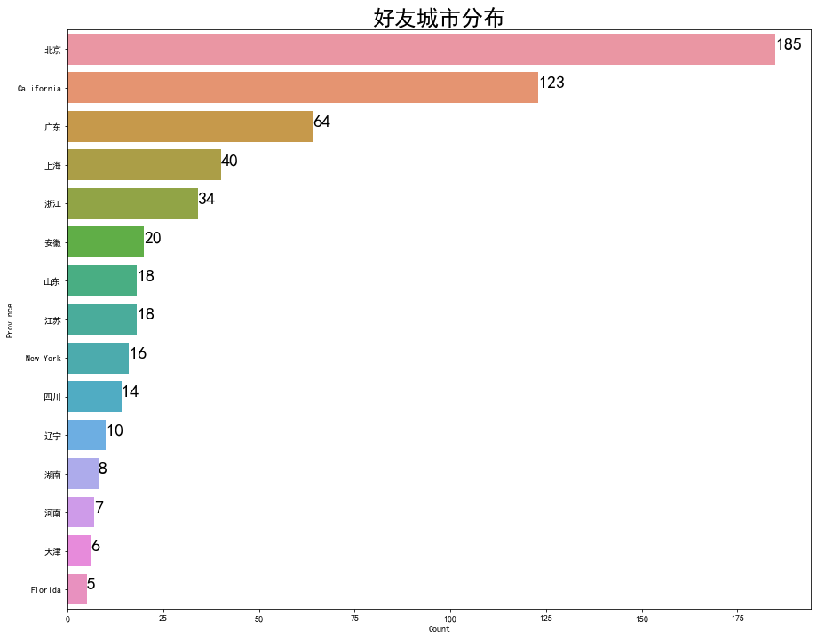
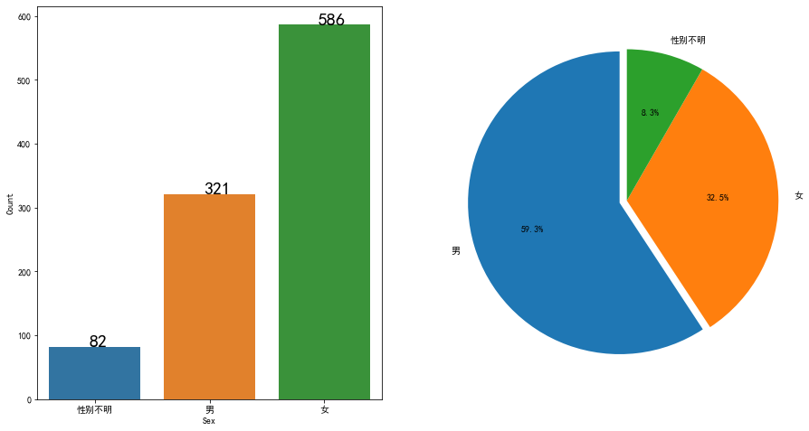

```python
#make sure you have itchat install by "pip install itchat" in terminal
import itchat, time
from itchat.content import *
import pandas as pd
import numpy as np
import os
import sys
import xlsxwriter
```

# 群打卡小助手
- 使用itchat打造
- 主要用于NGO的群管理
    + 1. 打卡助手(被at后的自动回复，以及结束打卡后记录今天的打卡人数）
    + 2. 群人数统计
    + 3. 好友分布（地域、性别）


```python
#确保打卡群保存到通讯录
```

### 1. 打卡小助手
- 1. __确保该群已经保存到通讯录__(对于打卡小助手不是必须，但是如果想要统计群人数必须将群保存到通讯录）
- 2. run下面这个instance "day",确保将你想要的群昵称“groupName”改成你想要的打卡群昵称
- 3. run完下面这个cell让你扫描二维码登陆
- 4. 登陆成功，等几秒，可以run下面那个day.run()
- 5. 结束打卡后可以用excel文档记录今天的打卡情况！


```python
today = []
#这是一个记录今天打卡成员的list

#创建一个新的打卡object
groupName = "你想要的groupname"
day = itchat.new_instance()
day.auto_login(hotReload=True,enableCmdQR=2)

#每次被at就回复“收到打卡” 只是在指定的群内，非指定群不影响
@day.msg_register(TEXT, isGroupChat = True)
def test(msg):
    if (msg.IsAt==True) & (msg["User"]["NickName"]== groupName):#这里groupName换成群的昵称
#         print(msg["Text"]) 如果你想获取msg里的文本内容
        #记录在list里今天打卡的人
        msg.user.send(u'@%s\u2005收到打卡' % (
            msg.actualNickName))
        print(today)
        #msg 打卡天数
    
        
        
#先跑这个，会出现二维码，扫描后，登陆，登陆完毕跑下面这行run。想要结束请interrupt kernal
```


```python

day.run()

#如果想要停止请interrupt kernal
```

    Start auto replying.
    

    {'MsgId': '1933530572081087590', 'FromUserName': '@@238c826ecf6288dbb53ed6af57e2f3d81a619a8f230431219cc25687b52f07ab', 'ToUserName': '@81d975e0bee7cce64098ce11037717dad148fc999c0a4af049dc64400cb3ea08', 'MsgType': 1, 'Content': '@wendywwww', 'Status': 3, 'ImgStatus': 1, 'CreateTime': 1587048053, 'VoiceLength': 0, 'PlayLength': 0, 'FileName': '', 'FileSize': '', 'MediaId': '', 'Url': '', 'AppMsgType': 0, 'StatusNotifyCode': 0, 'StatusNotifyUserName': '', 'RecommendInfo': {'UserName': '', 'NickName': '', 'QQNum': 0, 'Province': '', 'City': '', 'Content': '', 'Signature': '', 'Alias': '', 'Scene': 0, 'VerifyFlag': 0, 'AttrStatus': 0, 'Sex': 0, 'Ticket': '', 'OpCode': 0}, 'ForwardFlag': 0, 'AppInfo': {'AppID': '', 'Type': 0}, 'HasProductId': 0, 'Ticket': '', 'ImgHeight': 0, 'ImgWidth': 0, 'SubMsgType': 0, 'NewMsgId': 1933530572081087590, 'OriContent': '', 'EncryFileName': '', 'ActualNickName': 'cool', 'IsAt': True, 'ActualUserName': '@791dfb653e4e32b180b2c09c286e871d84754414fd9aa13f4e2cb54c57ffc1b4', 'User': <Chatroom: {'MemberList': <ContactList: [<ChatroomMember: {'MemberList': <ContactList: []>, 'Uin': 0, 'UserName': '@4ba7072368ae3e986c9612fe298b5600d935414a685a6498eb0734757bd191ca', 'NickName': '操风琴', 'AttrStatus': 100645, 'PYInitial': '', 'PYQuanPin': '', 'RemarkPYInitial': '', 'RemarkPYQuanPin': '', 'MemberStatus': 0, 'DisplayName': '', 'KeyWord': ''}>, <ChatroomMember: {'MemberList': <ContactList: []>, 'Uin': 0, 'UserName': '@81d975e0bee7cce64098ce11037717dad148fc999c0a4af049dc64400cb3ea08', 'NickName': 'wendywwww', 'AttrStatus': 100765733, 'PYInitial': '', 'PYQuanPin': '', 'RemarkPYInitial': '', 'RemarkPYQuanPin': '', 'MemberStatus': 0, 'DisplayName': '', 'KeyWord': ''}>, <ChatroomMember: {'MemberList': <ContactList: []>, 'Uin': 0, 'UserName': '@47488857fea03749483db6597417e82f0455b66ce26c816e4c0ea086c4497370', 'NickName': '天空', 'AttrStatus': 102333, 'PYInitial': '', 'PYQuanPin': '', 'RemarkPYInitial': '', 'RemarkPYQuanPin': '', 'MemberStatus': 0, 'DisplayName': '', 'KeyWord': ''}>, <ChatroomMember: {'MemberList': <ContactList: []>, 'Uin': 0, 'UserName': '@8a24decb2af39be281f133110577692b2aacd35c9984dc926a383fd240df0ec8', 'NickName': '汪章良', 'AttrStatus': 98365, 'PYInitial': '', 'PYQuanPin': '', 'RemarkPYInitial': '', 'RemarkPYQuanPin': '', 'MemberStatus': 0, 'DisplayName': '', 'KeyWord': ''}>, <ChatroomMember: {'MemberList': <ContactList: []>, 'Uin': 0, 'UserName': '@791dfb653e4e32b180b2c09c286e871d84754414fd9aa13f4e2cb54c57ffc1b4', 'NickName': '琼姐', 'AttrStatus': 4133, 'PYInitial': '', 'PYQuanPin': '', 'RemarkPYInitial': '', 'RemarkPYQuanPin': '', 'MemberStatus': 0, 'DisplayName': 'cool', 'KeyWord': ''}>]>, 'Uin': 0, 'UserName': '@@238c826ecf6288dbb53ed6af57e2f3d81a619a8f230431219cc25687b52f07ab', 'NickName': '汪采薇求职群', 'HeadImgUrl': '/cgi-bin/mmwebwx-bin/webwxgetheadimg?seq=0&username=@@238c826ecf6288dbb53ed6af57e2f3d81a619a8f230431219cc25687b52f07ab&skey=@crypt_130a245e_b6ad0bc1d42e6d3d4b4389146064757e', 'ContactFlag': 3, 'MemberCount': 5, 'RemarkName': '', 'HideInputBarFlag': 0, 'Sex': 0, 'Signature': '', 'VerifyFlag': 0, 'OwnerUin': 0, 'PYInitial': 'WCWQZQ', 'PYQuanPin': 'wangcaiweiqiuzhiqun', 'RemarkPYInitial': '', 'RemarkPYQuanPin': '', 'StarFriend': 0, 'AppAccountFlag': 0, 'Statues': 1, 'AttrStatus': 0, 'Province': '', 'City': '', 'Alias': '', 'SnsFlag': 0, 'UniFriend': 0, 'DisplayName': '', 'ChatRoomId': 0, 'KeyWord': '', 'EncryChatRoomId': '@2c4b4734913e2bd89ffb1ec1fc6fd7d3', 'IsOwner': 0, 'IsAdmin': None, 'Self': <ChatroomMember: {'MemberList': <ContactList: []>, 'Uin': 0, 'UserName': '@81d975e0bee7cce64098ce11037717dad148fc999c0a4af049dc64400cb3ea08', 'NickName': 'wendywwww', 'AttrStatus': 100765733, 'PYInitial': '', 'PYQuanPin': '', 'RemarkPYInitial': '', 'RemarkPYQuanPin': '', 'MemberStatus': 0, 'DisplayName': '', 'KeyWord': ''}>, 'HeadImgUpdateFlag': 1, 'ContactType': 0, 'ChatRoomOwner': '@47488857fea03749483db6597417e82f0455b66ce26c816e4c0ea086c4497370'}>, 'Type': 'Text', 'Text': '@wendywwww'}
    []
    

    Bye~
    


```python
#today 这个list保存了所有打卡的人的群昵称，如果没设置群昵称，那么就是本人昵称
```


```python
#先登录
chatroom = itchat.new_instance()
chatroom.auto_login(hotReload = True,enableCmdQR = 2)

```


```python
#创建一个今日日期的excel文档 记录今天的打卡情况
def check_daka(group_name,today_list):
    todaydate = datetime.date.today()
    workbook = xlsxwriter.Workbook("打卡" +str(todaydate)+".xlsx")
    counter = 0
    worksheet = workbook.add_worksheet(str(todaydate))
    worksheet.write(0,0,"微信名称")
    worksheet.write(0,1,"群备注")
    worksheet.write(0,2,"备注")
    worksheet.write(0,3,"是否打卡")
    myroom = chat.search_chatrooms(name = group_name)[0]#这里需要改成自己的groupName
    username = myroom["UserName"]
    detailed = chatroom.update_chatroom(username,detailedMember = True)

    print("群名：{} \t 人数：{}".format(group_name,len(detailed['MemberList'])))
    nickname=[] #真实昵称
    displayname=[] #群备注
    remark = [] #我给的备注

    for c in detailed['MemberList']:
        
        nickname.append(c['NickName'])
        displayname.append(c['DisplayName'])
        remark.append(c["RemarkName"])
        #将用户信息写入相应的工作薄中
    for x in range(len(detailed['MemberList'])):
        worksheet.write(x+1,0,nickname[x])
        worksheet.write(x+1,1,displayname[x])
        worksheet.write(x+1,2,remark[x])
        
        if (displayname[x] in today_list) | (nickname[x] in today_list):
            worksheet.write(x+1,3,"Yes")
            counter+=1
        
            
        else:
            worksheet.write(x+1,3,"No")
        #输出一点提示信息

    print("worksheet {} finished".format(group_name))
    print("今日打卡人数" + str(counter))
    workbook.close()
```


```python
check_daka("导师管理小组",today) #replace this string with your group chat name，请确保你有把那个群放进备忘录
```

    群名：导师管理小组 	 人数：5
    worksheet 导师管理小组 finished
    今日打卡人数0
    

### 2. 群记录助手
- 1. 记录所有群名&群人数
- 2. 在一个excel文档里记录每个群的微信昵称和群昵称，每一个群组是一个worksheet


```python
roomlist = chat.get_chatrooms()[0]
```


```python
def chatroom_stats():
    workbook=xlsxwriter.Workbook("群聊用户名单.xlsx")
    for i in range(0,len(roomlist)-1):
        #根据群聊名称在表单中创建工作薄
        worksheet=workbook.add_worksheet(roomslist[i]['NickName'])
        #添加表头
        worksheet.write(0,0,"微信名称")
        worksheet.write(0,1,"群备注")
        #获取群聊用户列表
        myroom=chat.search_chatrooms(name=roomslist[i]['NickName'])
        #获取群聊名称
        gsp=chat.update_chatroom(myroom[0]['UserName'], detailedMember=True)

        print("群名：{} \t 人数：{}".format(roomslist[i]['NickName'],len(gsp['MemberList'])))

        nickname=[]
        displayname=[]

        for c in gsp['MemberList']:
            nickname.append(c['NickName'])
            displayname.append(c['DisplayName'])
        #将用户信息写入相应的工作薄中
        for x in range(len(gsp['MemberList'])):
            worksheet.write(x+1,0,nickname[x])
            worksheet.write(x+1,1,displayname[x])
        #输出一点提示信息
        print("sheet {} finished".format(roomslist[i]['NickName']))
    #关闭工作表
    workbook.close()
#————————————————
#版权声明：本文为CSDN博主「King_key」的原创文章，遵循 CC 4.0 BY-SA 版权协议，转载请附上原文出处链接及本声明。
#原文链接：https://blog.csdn.net/King_key/java/article/details/100052875

```


```python
chatroom_stats()
```

# 获取好友信息

- 1. 好友城市分布
- 2. 好友性别分布
- 摘抄自[https://www.jianshu.com/p/4ab4fe8ac4ce]


```python
import seaborn as sns
import matplotlib.pyplot as plt
import warnings
import re
from scipy.misc import imread  
#import 所有的画图工具
```


```python
#创建一个新的好友object
friends = itchat.new_instance()
friends.auto_login(hotReload=True,enableCmdQR=2)
```


```python
myFriends = friends.get_friends(update=True)
#获取好友列表
```


```python
df = pd.DataFrame(myFriends)
#创建dataframe
```


    0       北京
    1    Bengo
    2         
    3       北京
    4         
    Name: Province, dtype: object


```python
#查看好友省份分布
from pylab import *
mpl.rcParams['font.sans-serif'] = ['SimHei']
plt.figure(figsize = (15,12))
data_temp = df.loc[df['Province']!='']
data_temp = data_temp.groupby(['Province'])['UserName'].count().reset_index()
data_temp = data_temp.nlargest(15,'UserName')
data_temp.columns = ['Province','Count']
sns.barplot(data=data_temp ,y='Province',x='Count')
for y,x in enumerate(data_temp['Count']):
    plt.text(x,y,x,fontsize = 20)
plt.title(u'好友城市分布',fontsize =25)
plt.show()
```





```python
#查看好友性别分布

df['Sex'] = df['Sex'].replace({0:u'性别不明',1:u'男',2:u'女'})
plt.figure(figsize = (15,8))
plt.subplot(1,2,1)
data_temp = df.groupby(['Sex'])['UserName'].count().reset_index()
data_temp = data_temp.sort_values('UserName')
data_temp.columns = ['Sex','Count']
sns.barplot(data=data_temp ,x='Sex',y='Count')
for x,y in enumerate(data_temp['Count']):
    plt.text(x-0.05,y,y,fontsize = 20)
plt.subplot(1,2,2)
sex_list = [u'男',u'女',u'性别不明']
countlist = df["Sex"].value_counts().values
explode = (0.05,0,0)
plt.pie(countlist,labels = sex_list,explode =explode,startangle = 90,autopct = '%3.1f%%')
plt.axis('equal')
plt.show()
```





###  wordcloud
- 1. 需要pip install wordcloud 以及pip install jieba，在国外比较好下载，国内需要使用国内镜像 + defaulttime 延时


```python
from wordcloud import WordCloud
back_color = imread('logo.jpg')  # 解析该图片
wc = WordCloud(background_color='white',  # 背景颜色
               max_words=1000,  # 最大词数
               mask=back_color,  # 以该参数值作图绘制词云，这个参数不为空时，width和height会被忽略
               max_font_size=100,  # 显示字体的最大值
               font_path="simfang.ttf",  # 解决显示口字型乱码问题
               random_state=42,  # 为每个词返回一个PIL颜色
               )
```

    C:\Users\Wendy W\Anaconda3\lib\site-packages\ipykernel_launcher.py:2: DeprecationWarning: `imread` is deprecated!
    `imread` is deprecated in SciPy 1.0.0, and will be removed in 1.2.0.
    Use ``imageio.imread`` instead.
      
    


<<<<<<< HEAD
```python
#wordcloud
#需要pip install wordcloud 以及pip install jieba
#在国外比较好下载，国内需要使用国内镜像 + defaulttime 延时


```
=======

    
>>>>>>> 345862032b0be49f035b55aba5821259fe864a33
