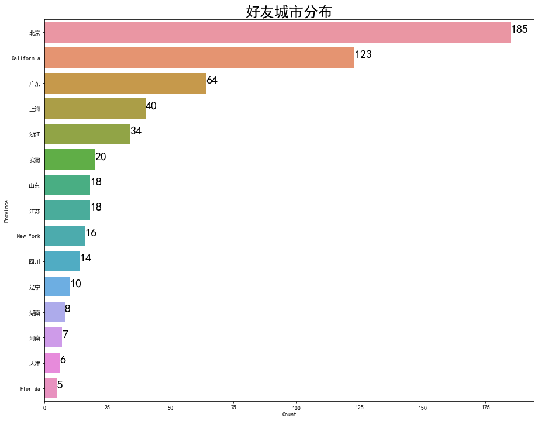
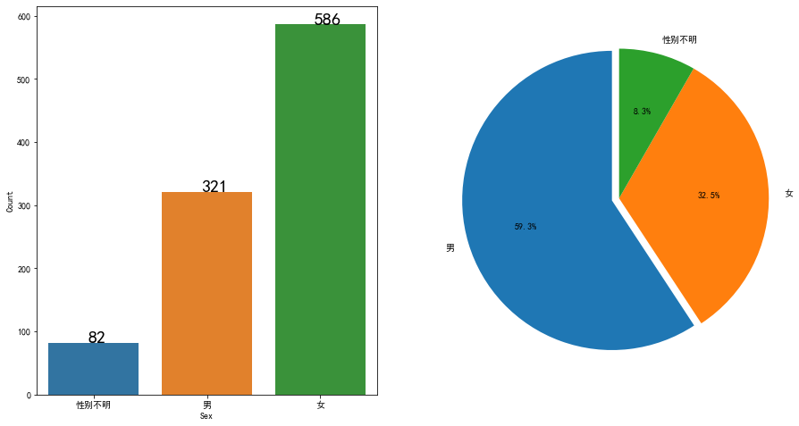

```python
#make sure you have itchat install by "pip install itchat" in terminal
import itchat, time
from itchat.content import *
import pandas as pd
import numpy as np
import time
import datetime
```


```python
#确保打卡群保存到通讯录
```

### 1. 打卡小助手
- 1. __确保该群已经保存到通讯录__
- 2. run下面这个instance "day",确保将你想要的群昵称“groupName”改成你想要的打卡群昵称
- 3. run完下面这个cell让你扫描二维码登陆
- 4. 登陆成功，等几秒，可以run下面那个day.run()


```python
today = []
#这是一个记录今天打卡成员的list

#创建一个新的打卡object

day = itchat.new_instance()
day.auto_login(hotReload=True,enableCmdQR=2)

#每次被at就回复“收到打卡” 只是在指定的群内，非指定群不影响
@day.msg_register(TEXT, isGroupChat = True)
def test(msg):
    if (msg.IsAt==True) & (msg["User"]["NickName"]== groupName):#这里groupName换成群的昵称
#         print(msg["Text"]) 如果你想获取msg里的文本内容
        #记录在list里今天打卡的人
        today.append(msg.actualNickName)
        msg.user.send(u'@%s\u2005收到打卡' % (
            msg.actualNickName))
        print(today)
        #msg 打卡天数
    
        
        
#先跑这个，会出现二维码，扫描后，登陆，登陆完毕跑下面这行run。想要结束请interrupt kernal
```


```python
day.run()
#如果想要停止请interrupt kernal
```

    Start auto replying.
    


```python

```

### 2. 获取好友信息

- 1. 好友城市分布
- 2. 好友性别分布


```python
import seaborn as sns
import matplotlib.pyplot as plt
import warnings
import re
from scipy.misc import imread  
#import 所有的画图工具
```


```python
#创建一个新的好友object
friends = itchat.new_instance()
friends.auto_login(hotReload=True,enableCmdQR=2)
```


```python
myFriends = friends.get_friends(update=True)
#获取好友列表
```


```python
df = pd.DataFrame(myFriends)
#创建dataframe
```


    0       北京
    1    Bengo
    2         
    3       北京
    4         
    Name: Province, dtype: object


```python
#查看好友省份分布
from pylab import *
mpl.rcParams['font.sans-serif'] = ['SimHei']
plt.figure(figsize = (15,12))
data_temp = df.loc[df['Province']!='']
data_temp = data_temp.groupby(['Province'])['UserName'].count().reset_index()
data_temp = data_temp.nlargest(15,'UserName')
data_temp.columns = ['Province','Count']
sns.barplot(data=data_temp ,y='Province',x='Count')
for y,x in enumerate(data_temp['Count']):
    plt.text(x,y,x,fontsize = 20)
plt.title(u'好友城市分布',fontsize =25)
plt.show()
```





```python
#查看好友性别分布

df['Sex'] = df['Sex'].replace({0:u'性别不明',1:u'男',2:u'女'})
plt.figure(figsize = (15,8))
plt.subplot(1,2,1)
data_temp = df.groupby(['Sex'])['UserName'].count().reset_index()
data_temp = data_temp.sort_values('UserName')
data_temp.columns = ['Sex','Count']
sns.barplot(data=data_temp ,x='Sex',y='Count')
for x,y in enumerate(data_temp['Count']):
    plt.text(x-0.05,y,y,fontsize = 20)
plt.subplot(1,2,2)
sex_list = [u'男',u'女',u'性别不明']
countlist = df["Sex"].value_counts().values
explode = (0.05,0,0)
plt.pie(countlist,labels = sex_list,explode =explode,startangle = 90,autopct = '%3.1f%%')
plt.axis('equal')
plt.show()
```




